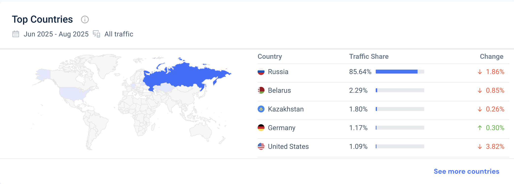
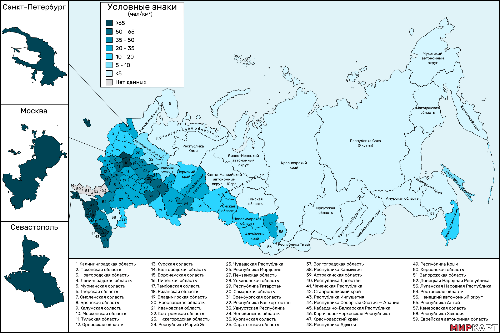
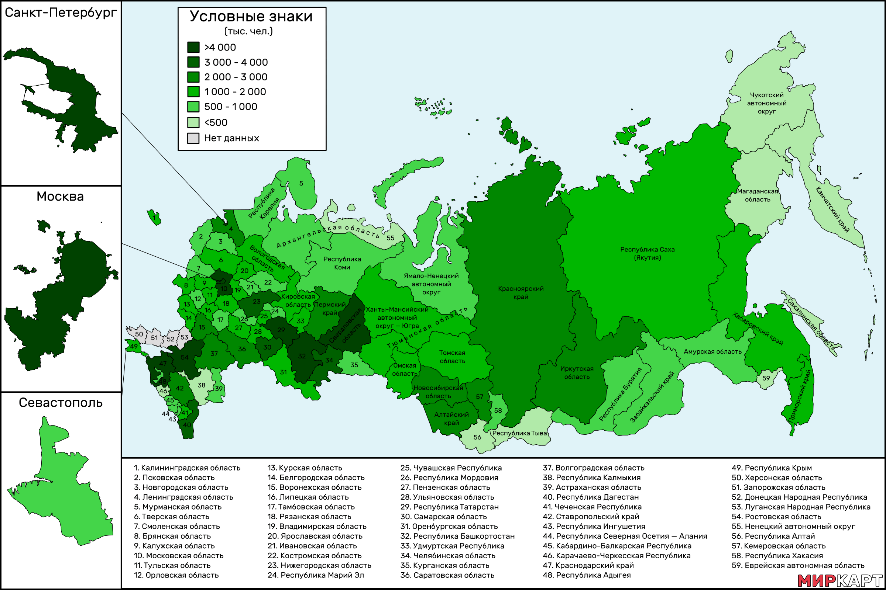
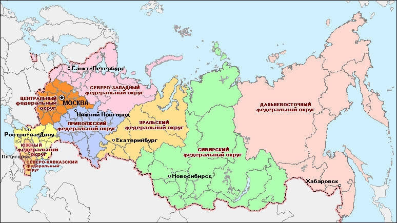
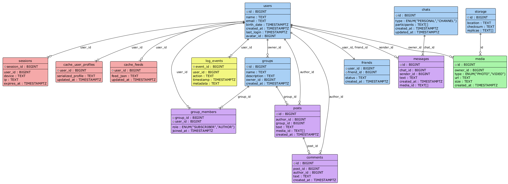
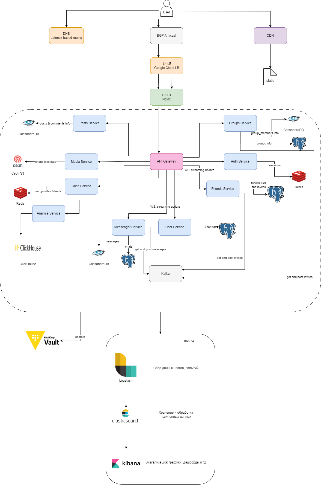

# highload_vk_technopark
Репозиторий для сдачи ДЗ по курсу "Проектирование высоконагруженных систем"

## 1. Тема и целевая аудитория 
**ВКонтакте**  — российская социальная сеть. 

### 📊 Целевая аудитория
**ВКонтакте** насчитывает **100,4 миллионов** активных пользователей в месяц ([источник](https://m.vk.com/press/q1-2022-results#:~:text=%D0%92%20%D0%BC%D0%B0%D1%80%D1%82%D0%B5%20%D0%BC%D0%B5%D1%81%D1%8F%D1%87%D0%BD%D0%B0%D1%8F%20%D0%B0%D1%83%D0%B4%D0%B8%D1%82%D0%BE%D1%80%D0%B8%D1%8F%20%D0%92%D0%9A%D0%BE%D0%BD%D1%82%D0%B0%D0%BA%D1%82%D0%B5%20%D0%B2%D0%BE%20%D0%B2%D1%81%D1%91%D0%BC%20%D0%BC%D0%B8%D1%80%D0%B5%20%D0%B2%D1%8B%D1%80%D0%BE%D1%81%D0%BB%D0%B0%20%D0%BD%D0%B0%202%2C4%25%20%D0%B8%20%D1%81%D0%BE%D1%81%D1%82%D0%B0%D0%B2%D0%B8%D0%BB%D0%B0%20%D1%80%D0%B5%D0%BA%D0%BE%D1%80%D0%B4%D0%BD%D1%8B%D0%B5%20100%2C4%20%D0%BC%D0%BB%D0%BD.)).

#### Географическое распределение пользователей

| Страна       | Пользователей в месяц | Доля от общей аудитории |
|--------------|----------------------|-------------------------|
| Россия       | 92,9 млн ([тут](https://vk.company/ru/press/releases/12005/))           | 85,64%  ([тут](https://pro.similarweb.com/#/digitalsuite/websiteanalysis/overview/website-performance/*/999/3m?webSource=Total&key=vk.com))                |
| Беларусь     | ~3 млн  ([тут](https://mlyn.by/20082025/vk-delaet-stavku-na-belarus/))            | 2,29% ([тут](https://pro.similarweb.com/#/digitalsuite/websiteanalysis/overview/website-performance/*/999/3m?webSource=Total&key=vk.com))                 |
| Казахстан    | 3,3 млн ([тут](https://www.ng.kz/modules/news/article.php?storyid=54884&start=15))            | 1,8% ([тут](https://pro.similarweb.com/#/digitalsuite/websiteanalysis/overview/website-performance/*/999/3m?webSource=Total&key=vk.com))                 |

[Источник](https://pro.similarweb.com/#/digitalsuite/websiteanalysis/overview/website-performance/*/999/3m?webSource=Total&key=vk.com)

### 🔑 Ключевой функционал (MVP), разнесенный на API
#### 🔐 Аутентификация и авторизация
- **`POST /api/auth/register`** - Регистрация нового пользователя
- **`POST /api/auth/login`** - Авторизация
- **`POST /api/auth/logout`** - Выход из системы

#### 👥 Пользователи
- **`GET /api/users/{id}`** - Получить профиль пользователя
- **`PATCH /api/users/{id}`** - Редактировать профиль пользователя
- **`GET /api/users?q={query}`** - Поиск пользователей

#### 🤝 Друзья
- **`GET /api/users/friends`** - Список друзей текущего пользователя
- **`POST /api/users/friends/{id}`** - Отправить заявку в друзья
- **`DELETE /api/users/friends/{id}`** - Удалить из друзей
- **`GET /api/users/friends/requests`** - Заявки в друзья

#### 🏢 Сообщества
- **`POST /api/groups`** - Создать сообщество
- **`GET /api/groups/{id}`** - Информация о сообществе
- **`PATCH /api/groups/{id}`** - Редактировать сообщество
- **`POST /api/groups/{id}`** - Удалить сообщество
- **`GET /api/groups/search?q={query}`** - Поиск сообществ
- **`POST /api/groups/{id}/join`** - Вступить в сообщество
- **`DELETE /api/groups/{id}/leave`** - Покинуть сообщество

#### 📝 Посты
- **`POST /api/posts`** - Создать пост
- **`GET /api/posts/{id}`** - Получить пост по ID
- **`PATCH /api/posts/{id}`** - Редактировать пост
- **`DELETE /api/posts/{id}`** - Удалить пост

#### 💬 Комментарии
- **`POST /api/posts/{id}/comments`** - Добавить комментарий
- **`GET /api/posts/{id}/comments`** - Получить комментарии к посту

#### 💭 Чаты
- **`GET /api/chats`** - Список чатов
- **`POST /api/chats`** - Создать чат
- **`GET /api/chats/{id}`** - История сообщений чата
- **`POST /api/chats/{id}/messages`** - Отправить сообщение

## 2. Расчет нагрузки

### 📊 Продуктовые метрики
* Месячная аудитория(MAU) - 100,4 млн ([источник](https://m.vk.com/press/q1-2022-results#:~:text=%D0%92%20%D0%BC%D0%B0%D1%80%D1%82%D0%B5%20%D0%BC%D0%B5%D1%81%D1%8F%D1%87%D0%BD%D0%B0%D1%8F%20%D0%B0%D1%83%D0%B4%D0%B8%D1%82%D0%BE%D1%80%D0%B8%D1%8F%20%D0%92%D0%9A%D0%BE%D0%BD%D1%82%D0%B0%D0%BA%D1%82%D0%B5%20%D0%B2%D0%BE%20%D0%B2%D1%81%D1%91%D0%BC%20%D0%BC%D0%B8%D1%80%D0%B5%20%D0%B2%D1%8B%D1%80%D0%BE%D1%81%D0%BB%D0%B0%20%D0%BD%D0%B0%202%2C4%25%20%D0%B8%20%D1%81%D0%BE%D1%81%D1%82%D0%B0%D0%B2%D0%B8%D0%BB%D0%B0%20%D1%80%D0%B5%D0%BA%D0%BE%D1%80%D0%B4%D0%BD%D1%8B%D0%B5%20100%2C4%20%D0%BC%D0%BB%D0%BD.))
* Дневная аудитория(DAU) - 61,1 млн ([источник](https://vk.company/ru/press/releases/12005/))

### 💾 Средний размер хранилища пользователя

#### Сообщения:
- **Ежедневно**: 15 млрд сообщений ([источник](https://blog.skillfactory.ru/auditoriya-soczialnyh-setej-i-messendzherov-v-2022-godu/))
- **Размер сообщения**: `~1 КБ`
- **Ежедневный объем**: `13,97` ТБ (15 млрд сообщений/день × 1 КБ)
- **На пользователя в день**: `245,5 КБ` (13,97 ТБ / 61,1 млн)
- **На пользователя в месяц**: **`7,2 МБ`** (245,5 КБ * 30)

#### Посты и комментарии:
*данные за март 2022 года ([источник](https://m.vk.com/press/q1-2022-results))

- **Количество пользователей**: `27 млн`
- **Публикаций в месяц**: `468 млн`
- **Размер публикации**: `~1 КБ`
- **Месячный объем**: `446,32 ГБ` (468 млн постов и комментариев × 1 КБ = 446,32 ГБ)
- **На пользователя в месяц**: `17,3 КБ` (446,32 ГБ / 27 млн = 17,3 КБ)

#### Медиаконтент:
*данные за лето 2024 года ([источник](https://vk.company/ru/press/releases/11834/#:~:text=%D0%9B%D0%B5%D1%82%D0%BE%D0%BC%202024%20%D0%B3%D0%BE%D0%B4%D0%B0%20%D0%BF%D0%B8%D0%BA%D0%BE%D0%B2%D1%8B%D0%B9%20%D0%BE%D0%B1%D1%8A%D0%B5%D0%BC%20%D0%B7%D0%B0%D0%B3%D1%80%D1%83%D0%B7%D0%BA%D0%B8%20%D0%BD%D0%BE%D0%B2%D0%BE%D0%B3%D0%BE%20%D0%BA%D0%BE%D0%BD%D1%82%D0%B5%D0%BD%D1%82%D0%B0%20%D0%B4%D0%BE%D1%85%D0%BE%D0%B4%D0%B8%D0%BB%20%D0%B4%D0%BE%201%20%D0%BF%D0%B5%D1%82%D0%B0%D0%B1%D0%B0%D0%B9%D1%82%D0%B0%20%D0%B2%20%D0%B4%D0%B5%D0%BD%D1%8C))

- **Ежедневный объём:** `1 ПБ`
- **На пользователя в день:** `18,4 МБ` (1 ПБ данных / 61,1 млн пользователей = 18,4 МБ)
- **На пользователя в месяц:** **`552 МБ`** (18,4 МБ * 30)

| **Тип контента**                 | **Средний объем на 1 пользователя в месяц**       |
| ----------------------- | ----------------------------------------- |
| Сообщения               | 7,2 МБ                                      |
| Посты и комментарии     | 17,3 КБ                                      |
| Медиа контент           | 552 МБ                                 |

### 💰 Среднее количество действий пользователя по типам контента в день

| **Тип контента**                 | **Среднее количество на 1 пользователя в день**|
| ----------------------- | -----------------------------------------      |
| Сообщения ([источник](https://blog.skillfactory.ru/auditoriya-soczialnyh-setej-i-messendzherov-v-2022-godu/))| **`246`** (15 млрд сообщений в день / 61,1 млн человек в день)    |
| Посты и комментарии ([источник](https://m.vk.com/press/q1-2022-results#:~:text=%D0%92%D0%9A%D0%BE%D0%BD%D1%82%D0%B0%D0%BA%D1%82%D0%B5%20%E2%80%94%20%D0%BB%D0%B8%D0%B4%D0%B8%D1%80%D1%83%D1%8E%D1%89%D0%B0%D1%8F%20%D0%B2%20%D0%A0%D0%BE%D1%81%D1%81%D0%B8%D0%B8%20%D0%BF%D0%BB%D0%BE%D1%89%D0%B0%D0%B4%D0%BA%D0%B0%20%D0%BF%D0%BE%20%D0%BE%D0%B1%D1%8A%D1%91%D0%BC%D1%83%20%D0%BA%D0%BE%D0%BD%D1%82%D0%B5%D0%BD%D1%82%D0%B0%20%D0%B8%20%D0%BA%D0%BE%D0%BB%D0%B8%D1%87%D0%B5%D1%81%D1%82%D0%B2%D1%83%20%D0%B0%D0%B2%D1%82%D0%BE%D1%80%D0%BE%D0%B2.%20%D0%9F%D0%BE%20%D0%B4%D0%B0%D0%BD%D0%BD%D1%8B%D0%BC%20Brand%20Analytics%20(3)%2C%20%D0%B2%20%D0%BC%D0%B0%D1%80%D1%82%D0%B5%20%D0%B1%D0%BE%D0%BB%D0%B5%D0%B5%2027%20%D0%BC%D0%BB%D0%BD%20%D0%B0%D0%B2%D1%82%D0%BE%D1%80%D0%BE%D0%B2%20%D0%BE%D0%BF%D1%83%D0%B1%D0%BB%D0%B8%D0%BA%D0%BE%D0%B2%D0%B0%D0%BB%D0%B8%20%D1%81%D0%B2%D1%8B%D1%88%D0%B5%20468%20%D0%BC%D0%BB%D0%BD%20%D0%BF%D0%BE%D1%81%D1%82%D0%BE%D0%B2%20%D0%B8%20%D0%BA%D0%BE%D0%BC%D0%BC%D0%B5%D0%BD%D1%82%D0%B0%D1%80%D0%B8%D0%B5%D0%B2%20%D0%92%D0%9A%D0%BE%D0%BD%D1%82%D0%B0%D0%BA%D1%82%D0%B5%20%E2%80%94%20%D1%8D%D1%82%D0%BE%20%D0%B1%D0%BE%D0%BB%D1%8C%D1%88%D0%B5%2C%20%D1%87%D0%B5%D0%BC%20%D0%BD%D0%B0%20%D0%B2%D1%81%D0%B5%D1%85%20%D0%BE%D1%81%D1%82%D0%B0%D0%BB%D1%8C%D0%BD%D1%8B%D1%85%20%D0%BF%D0%BB%D0%BE%D1%89%D0%B0%D0%B4%D0%BA%D0%B0%D1%85%2C%20%D0%B2%D0%BC%D0%B5%D1%81%D1%82%D0%B5%20%D0%B2%D0%B7%D1%8F%D1%82%D1%8B%D1%85.))   | **`17`**  (468 млн постов и комментариев / 27 млн авторов)    |     
|Заявки в друзья ([источник](https://vk.com/press/friends-research#:~:text=%D0%BA%D0%B0%D0%B6%D0%B4%D1%8B%D0%B9%20%D0%B4%D0%B5%D0%BD%D1%8C%205%2C5%20%D0%BC%D0%BB%D0%BD%20%D0%BF%D0%BE%D0%BB%D1%8C%D0%B7%D0%BE%D0%B2%D0%B0%D1%82%D0%B5%D0%BB%D0%B5%D0%B9%20%D0%BD%D0%B0%D1%85%D0%BE%D0%B4%D1%8F%D1%82%20%D0%B4%D1%80%D1%83%D0%B3%D0%B0%20%D0%B2%20%D1%81%D0%BE%D1%86%D1%81%D0%B5%D1%82%D0%B8))    |  **`0,09`** (5,5 млн заявок в день / 61,1 млн человек в день)  |     

### 📈 Тенденция увеличения объема данных
В 2014 году общий объем данных ВК составлял `240 ПБ` [источник](https://vk.com/wall-32295218_252849?offset=60#:~:text=%D0%9C%D1%8B%20%D1%82%D1%83%D1%82%20%D1%83%D0%B7%D0%BD%D0%B0%D0%BB%D0%B8,%D0%BF%D1%80%D0%B8%D0%BA%D0%B8%D0%BD%D0%B5%D0%BC%2C%20%D1%8D%D1%82%D0%BE%20%D0%BC%D0%BD%D0%BE%D0%B3%D0%BE). В 2024 году объём хранилища ВК превышал `1430 ПБ` [источник](https://itspeaker.ru/news/vk-obedinyaet-videokontent-v-oblachnom-khranilishche/#:~:text=1%2C5%20%D0%BC%D0%BB%D1%80%D0%B4%20%D0%B3%D0%B8%D0%B3%D0%B0%D0%B1%D0%B0%D0%B9%D1%82-,%D0%9E%D0%B1%D1%8A%D0%B5%D0%BC%20%D1%85%D1%80%D0%B0%D0%BD%D0%B8%D0%BB%D0%B8%D1%89%D0%B0%20VK%20%D0%BF%D1%80%D0%B5%D0%B2%D1%8B%D1%88%D0%B0%D0%B5%D1%82%201%2C5%20%D0%BC%D0%BB%D1%80%D0%B4%20%D0%B3%D0%B8%D0%B3%D0%B0%D0%B1%D0%B0%D0%B9%D1%82,-%D0%A0%D0%B5%D0%B4%D0%B0%D0%BA%D1%86%D0%B8%D1%8F). Объем данных, которые хранит и использует сервис, ежегодно увеличивается в среднем  на `119 ПБ` ((1430 - 240) / 10). Однако в IT данный показатель растет не линейно, а экспоненциально. Совокупный среднегодовой темп роста можно рассчитать по формуле [CAGR](https://ru.wikipedia.org/wiki/CAGR): получаетсчя прирост каждый год на в среднем на `19%`.

#### Сетевой трафик
По открытым данным ([источник](https://dev.vk.com/ru/api/api-requests#:~:text=%D0%9A%20%D0%BC%D0%B5%D1%82%D0%BE%D0%B4%D0%B0%D0%BC%20API,%D1%80%D0%B0%D0%BC%D0%BA%D0%B0%D1%85%20%D0%BE%D0%B4%D0%BD%D0%BE%D0%B3%D0%BE%20%D0%B7%D0%B0%D0%BF%D1%80%D0%BE%D1%81%D0%B0.)) RPS варьируется от 3 до 20: 3 - с ключом доступа пользователя, 20 - с ключом доступа сообщества. Однако в некоторых случаях этот показатель варьируется от количества пользователей приложения и может доходить до 60 ([источник](https://dev.vk.com/ru/api/api-requests#:~:text=1%C2%A0000%C2%A0000-,60,-%D0%94%D0%BB%D1%8F%20%D0%BC%D0%B5%D1%82%D0%BE%D0%B4%D0%BE%D0%B2%20%D1%81%D0%B5%D0%BA%D1%86%D0%B8%D0%B8)).

| Функционал      | Примерный размер запроса/ответа | Частота запросов на пользователя в день | Расчетный сетевой трафик на пользователя в день | Пояснения |
|-----------------|---------------------------------|------------------------------------------|-------------------------------------------------|-----------|
| Авторизация     | 1-2 КБ                          | 1-3                                      | ~2-6 КБ                                         | Редкие операции login/logout/register, малый объем данных. |
| Пользователи    | 5-20 КБ                        | 2-5                                      | 10-100 КБ                                      | Запросы профиля, поиск, редактирование, JSON с данными профиля. |
| Друзья          | 10-30 КБ                      | 5-10                                     | 50-300 КБ                                      | Запросы списков друзей и заявок, возвращается список ID с профилями. |
| Сообщества      | 10-50 КБ                     | 2-5                                      | 20-250 КБ                                      | Информация о сообществах, их поиск, управление. Размер зависит от кол-ва данных в ответе. |
| Посты           | ~10 КБ                       | 10-20                                    | 100-200 КБ                                     | Создание, получение, редактирование постов с метаданными. |
| Комментарии     | 2-5 КБ                       | 10-20                                    | 20-100 КБ                                      | Комментарии к постам, размер зависит от количества комментариев. |
| Чаты            | 1 КБ (сообщение)              | 200+ сообщений                           | 200 КБ - 1 МБ+                                | Сообщения небольшого размера (до 1 КБ), но высокая частота, запросы истории сообщений могут быть значительно больше. |

## 3. Глобальная балансировка нагрузки

### 🌐 Функциональное разбиение по доменам
На данный момент [источник](https://www.nic.ru/info/blog/kak-vk-upravlyaet-domennym-portfelem-strategiya-rebrending-i-bezopasnost/#:~:text=%D0%BA%D0%BE%D1%80%D0%BE%D1%82%D0%BA%D0%BE%D0%B3%D0%BE%20%D0%B8%20%D0%BB%D0%B0%D0%BA%D0%BE%D0%BD%D0%B8%D1%87%D0%BD%D0%BE%D0%B3%D0%BE-,vk.com,-.%20%D0%9F%D0%BE%D0%B7%D0%B6%D0%B5%20%D1%81%D0%BE%D1%86%D1%81%D0%B5%D1%82%D1%8C%20%D0%92%D0%9A%D0%BE%D0%BD%D1%82%D0%B0%D0%BA%D1%82%D0%B5) весь исследуемый нами функционал находится на одном домене `vk.com`. Стоит отметить, что также есть домены `vk.me` (мессенджер) `vk.cc` (сокращатель ссылок), `vk.ru` (защита от фишинга). Кроме того, VK системно регистрирует новые имена под конкретные сервисы, например `vkfest.ru`, `vkclips.app`, `vkplay.ru`, `vkvideo.ru`.

Но это разбиение для нас не столь важно, поскольку функционал, описанный в API из задания 1, располагается на главном домене `vk.com`.

### 📍 Обоснования расположения ДЦ

Основная аудитория ВКонтакте находится в России (85% всех пользователей), а так же в ближайших к России странах СНГ (Беларусь, Казахстан).
На сегодняшний день [источник](https://inclient.ru/vk-stats/#:~:text=%D0%A1%D0%B5%D0%B3%D0%BE%D0%B4%D0%BD%D1%8F%20%D0%B8%D1%81%D0%BF%D0%BE%D0%BB%D1%8C%D0%B7%D1%83%D1%8E%D1%82%2076%25) 76% населения России пользуются ВК. Поэтому размещение ДЦ и ЦОД должно напрямую зависеть от плотности и численности населения на территории страны.

**Плотность населения**

[источник](https://xn--80apggvco.xn--p1ai/%D0%BA%D0%B0%D1%80%D1%82%D1%8B?id=90)

**Численность населения**

[источник](https://xn--80apggvco.xn--p1ai/%D0%BA%D0%B0%D1%80%D1%82%D1%8B?id=388)

### 🏢 Расположение ДЦ

- **Санкт-Петербург** - один из самых заселенных по численности городов, с высокой плотностью населения, поэтому здесь необходим свой датацентр, который мог бы обслуживать также и европейскую часть нашей страны - Калининградскую область.
- **Москва** - самый заселенный город страны с численностью более 13 млн человек ([источник](https://gogov.ru/population-ru/msk#:~:text=%D0%B2%20%D0%9C%D0%BE%D1%81%D0%BA%D0%B2%D1%8B%20%D1%81%D0%BE%D1%81%D1%82%D0%B0%D0%B2%D0%BB%D1%8F%D0%BB%D0%B0-,13%20258%20262%20%D1%87%D0%B5%D0%BB.,-%D0%9F%D1%80%D0%B8%D1%80%D0%BE%D1%81%D1%82%20%D0%BF%D0%BE%20%D1%81%D1%80%D0%B0%D0%B2%D0%BD%D0%B5%D0%BD%D0%B8%D1%8E)), невероятно большое число пользователей по сравнению с другими регионами, поэтому здесь точно необходим свой датацентр (мб даже и не один).
- **Архангельск** - датацентр будет обслуживать весь Северо-Западный федеральный округ.
- **Смоленск** - датацентр для обслуживания Центрального федерального округа, а также республики Беларусь.
- **Краснодар** - датацентр для обслуживания южных территорий страны и республики Крым.
- **Челябинск** - датацентр на Уральский и Приволжский федеральные округа, а также республику Казахстан.
- **Новосибирск** - датацентр на Сибирский федеральный округ.
- **Хабаровск** - датацентр на дальневосточный федеральный округ.

### 🔄 Схема DNS балансировки 
Т.к. все датацентры расположены в одной стране, использовать Geo-based DNS было бы не совсем эффективно. Поэтому для достижения быстродействия было правильно использовать Latency-based DNS.

### 🌍 Схема Anycast балансировки
 Датацентры, расположенные в Москве и Санкт-Петербурге, испытывают потенциально наибольшую нагрузку. Поэтому будет разумно объединить их под одним IP адресом и использовать BGP Anycast.

#### Почему решил сделать так?
- Latency-based DNS балансировка целесообразна для всей страны с несколькими датацентрами, чтобы направить пользователей на ближайший по задержке датацентр.
- Anycast же применяется для точек с наибольшей нагрузкой (Москва и СПб) для распределения трафика по сети более "низкоуровнево" с помощью маршрутизации BGP, обеспечивая быстрый и устойчивый отклик.

Таким образом, latency-based DNS балансировка применяется глобально по территории России и СНГ, чтобы направить пользователей на самый быстрый датацентр. В то же время Anycast тасует нагрузку между Москвой и Санкт-Петербургом на более низком сетевом уровне, помогая эффективно справляться с пиковыми нагрузками в самых загруженных локациях.
Эта комбинация обеспечивает баланс между быстродействием для всех пользователей и устойчивостью сети при высокой нагрузке на основные узлы.

## 4. Локальная балансировка нагрузки

### Схема локальной балансировки нагрузки

Локальная балансировка нагрузки в высоконагруженных системах, таких как ВКонтакте, обычно построена по многоуровневой схеме: от внешних балансировщиков к внутренним, с учётом горизонтального масштабирования и резервирования на каждом уровне.([Источник](https://blog.nginx.org/blog/testing-performance-nginx-ingress-controller-kubernetes), [Источник](https://blog.nginx.org/blog/testing-the-performance-of-nginx-and-nginx-plus-web-servers))

**Структура уровней балансировки:**

* 1 уровень: внешние балансировщики принимают входящий трафик и выполняют SSL Termination ([Источник](https://www.ssldragon.com/ru/blog/what-is-ssl-termination/)).
* 2 уровень: [L4](https://dzen.ru/a/Zsm12k4R6gXwmfpV#:~:text=%D0%91%D0%B0%D0%BB%D0%B0%D0%BD%D1%81%D0%B8%D1%80%D0%BE%D0%B2%D1%89%D0%B8%D0%BA%20%D0%BD%D0%B0%20L4%20%D0%BF%D1%80%D0%B8%D0%BD%D0%B8%D0%BC%D0%B0%D0%B5%D1%82%20%D1%80%D0%B5%D1%88%D0%B5%D0%BD%D0%B8%D1%8F%20%D0%BD%D0%B0%20%D0%BE%D1%81%D0%BD%D0%BE%D0%B2%D0%B5%20%D0%B0%D0%BB%D0%B3%D0%BE%D1%80%D0%B8%D1%82%D0%BC%D0%B0%20%D0%B1%D0%B0%D0%BB%D0%B0%D0%BD%D1%81%D0%B8%D1%80%D0%BE%D0%B2%D0%BA%D0%B8%20%D0%B8%20%D0%B8%D0%BD%D1%84%D0%BE%D1%80%D0%BC%D0%B0%D1%86%D0%B8%D0%B8%20%D0%BE%20TCP/UDP%2D%D1%81%D0%B5%D1%81%D1%81%D0%B8%D1%8F%D1%85%2C%20%D0%B2%D0%BA%D0%BB%D1%8E%D1%87%D0%B0%D1%8F%20IP%2D%D0%B0%D0%B4%D1%80%D0%B5%D1%81%D0%B0%2C%20%D0%BF%D0%BE%D1%80%D1%82%D1%8B%20%D0%B8%D1%81%D1%82%D0%BE%D1%87%D0%BD%D0%B8%D0%BA%D0%B0%20%D0%B8%20%D0%BD%D0%B0%D0%B7%D0%BD%D0%B0%D1%87%D0%B5%D0%BD%D0%B8%D1%8F.), Балансировщик на L4 принимает решения на основе алгоритма балансировки и информации о TCP/UDP-сессиях, включая IP-адреса, порты источника и назначения.
* 3 уровень: [L7](https://habr.com/ru/companies/vk/articles/347026/), Application Load Balancers (например, NGINX Ingress Controller) ([Источник](https://networkguru.ru/balansirovshhiki-nagruzki-application-load-balancer-i-network-load-balancer-v-amazon-web-services-aws/)) маршрутизируют запросы к отдельным приложениям или микросервисам.

**Резервирование:**
* Для обеспечения отказоустойчивости предлагаю использовать схему 3/2N ([Источник](https://www.alldc.ru/useful/question/4867.html#:~:text=%D1%81%D1%87%D0%B8%D1%82%D0%B0%D0%B5%D1%82%D1%81%D1%8F%20%D1%81%D0%B0%D0%BC%D0%BE%D0%B9%20%D0%BE%D1%82%D0%BA%D0%B0%D0%B7%D0%BE%D1%83%D1%81%D1%82%D0%BE%D0%B9%D1%87%D0%B8%D0%B2%D0%BE%D0%B9.-,%D0%A1%D1%85%D0%B5%D0%BC%D0%B0%203/2N,-%D0%B2%D0%BA%D0%BB%D1%8E%D1%87%D0%B0%D0%B5%D1%82%20%D0%B2%20%D1%81%D0%B5%D0%B1%D1%8F)), т.к., на мой взгляд, она наиболее подходящая из соотношения отказоустойчивости и числа источников бесперебойного питания (ИПБ). Схема 3/2N включает в себя все преимущества системы 2N, но такая система загружена на 2/3, а не на 50/50 как в системе 2N, соответственно и производительность у 3/2N будет намного выше, а счета за электричество – значительно меньше.

### Расчёт количества балансировщиков

**Метрики производительности NGINX:**

- В реальных тестах NGINX Ingress Controller (Kubernetes) ([Источник](https://blog.nginx.org/blog/testing-performance-nginx-ingress-controller-kubernetes)):
    - RPS (запросов в секунду на 1‑КБ файл): ~342,000 на 16–24 CPU (HTTP и HTTPS практически одинаково).
    - TPS (SSL/TLS connections per second, для termination): ~56,000 на 16 CPU с HyperThreading, ~58,000 на 24 CPU (максимум).
    - Пропускная способность: до 8.8 Гбит/с при стандартной сетевой картtе Intel 10‑Gigabit X540‑AT2 ([Источник](https://blog.nginx.org/blog/testing-performance-nginx-ingress-controller-kubernetes#:~:text=Performance%20peaked%20at%20just%20under%2010%20Gbps%2C%20as%20expected%3A%20the%20secondary%20node%20of%20the%20Kubernetes%20cluster%20is%20equipped%20with%20an%20Intel%2010%E2%80%91Gigabit%20X540%E2%80%91AT2%20Network%20Interface%20Card.)).
- Для bare-metal NGINX (HTTPS termination) ([Источник](https://blog.nginx.org/blog/testing-the-performance-of-nginx-and-nginx-plus-web-servers)):
    - CPS (connections per second), SSL/HTTPS: ~10,000 на 24–36 CPU.

**Ограничения и расчёт:**

- Основные лимитирующие факторы — способность terminate SSL connections (TPS) и пропускная способность сетевой карты ([Источник](https://blog.nginx.org/blog/testing-performance-nginx-ingress-controller-kubernetes#:~:text=SSL/TLS%20transactions%20per%20second%20(TPS))).
- При расчёте максимального числа балансировщиков требуется учесть пиковую входящую нагрузку (например, 1 миллион TPS — понадобится минимум 1000000/58000 = 18 балансировщиков NGINX Ingress Controller c 24 CPU).
- Для отказоустойчивости по формуле резервирования 3/2N: если по мощности надо 18 балансировщиков, для полной отказоустойчивости потребуется минимум 27 узлов.

**Примеры расчёта:**

| Фактор | Значение по источнику | Как учитывать |
| :-- | :-- | :-- |
| SSL TPS | до ~58,000 на 24 CPU | лимит по termination |
| CPS (HTTPS) | ~10,000 на 24–36 CPU | для HTTPS |

*Если пиковая нагрузка — 220,000 SSL/HTTPS соединений в секунду:*

- Требуется: 220000/58000 = 4 балансировщика по TPS.
- Для отказоустойчивости: 3/2 *4 = 6 балансировщиков.

**Ограничения по сети:**

- При крупном медиаконтенте (например, 10+ Гбит/с) — нужен отдельный балансировщик на каждую сетевую карту (или использовать масштабирование по сетевым интерфейсам в расчёте: один NGINX instance — одна 10 сеть).

***
---

## 5. Логическая схема БД

### 📊 ER-диаграмма

---

### 📋 Таблица с описанием сущностей
* средние размеры строки посчитаны приблизительно на основе памяти типов данных в Postgre: [источник](https://datafinder.ru/products/postgresql-tipy-dannyh)

| Таблица                 | Назначение                        | Основные поля                                                                | Средний размер строки | QPS чтения / записи |
| ----------------------- | --------------------------------- | ---------------------------------------------------------------------------- | --------------------------------------- | --------------------- |
| **users**               | Профиль пользователя              | `id` - BIGINT, `name` - TEXT, `email` - TEXT, `birth_date` - TIMESTAMPTZ, `created_at` - TIMESTAMPTZ, `last_login` - TIMESTAMPTZ, `avatar_id` - BIGINT | ~2 КБ                  | R: 150k / W: 10k    | 
| **friends**             | Отношения между пользователями    | `user_id` - BIGINT, `friend_id` - BIGINT, `status` - TEXT, `created_at` - TIMESTAMPTZ                              | ~200 Б                                | R: 100k / W: 5k     |
| **groups**              | Сообщества                        | `id` - BIGINT, `name` - TEXT, `description` - TEXT, `owner_id` - BIGINT, `created_at` - TIMESTAMPTZ                        | ~1 КБ                                         | R: 30k / W: 2k      | 
| **group_members**       | Участники сообществ               | `group_id` - BIGINT, `user_id` - BIGINT, `role` - ENUM("SUBSCRIBER", "AUTHOR"), `joined_at` - DATETOME                                  | ~100 Б                                         | R: 50k / W: 2k      | 
| **posts**               | Публикации                        | `id` - BIGINT, `author_id` - BIGINT, `group_id` - BIGINT, `text` - TEXT, `created_at` - TIMESTAMPTZ, `media_id` - TEXT[]            | ~2 КБ                                 | R: 500k / W: 50k    |
| **comments**            | Комментарии к постам              | `id` - BIGINT, `post_id` - BIGINT, `author_id` - BIGINT, `text` - TEXT, `created_at` - TIMESTAMPTZ                          | ~500 Б                        | R: 800k / W: 100k   |
| **messages**            | Сообщения в чатах                 | `id` - BIGINT, `chat_id` - BIGINT, `sender_id` - BIGINT, `text` - TEXT, `created_at` - TIMESTAMPTZ, `media_id` - TEXT[]             | ~1 КБ                          | R: 1M / W: 200k     | 
| **chats**               | Метаданные чатов                  | `id` - BIGINT, `type` - ENUM("PERSONAL", "CHANNEL"), `participants` - TEXT[], `created_at` - TIMESTAMPTZ, `updated_at` - TIMESTAMPTZ                   | ~300 Б                      | R: 10k / W: 1k      |
| **media**               | Медиаконтент (фото, видео, аудио) | `id` - BIGINT, `owner_id` - BIGINT, `type` - ENUM("PHOTO", "VIDEO"), `url` - TEXT, `size` - TEXT, `created_at` - TIMESTAMPTZ                        | ~200 Б (метаданные)        | R: 2M / W: 100k     | 
| **storage**             | Физическое размещение медиа       | `id` - BIGINT, `location` - TEXT, `checksum` - TEXT, `replicas` - TEXT[]                                   | ~100 Б                             | R: 10k / W: 1k      | 
| **sessions**            | Сессии и авторизация              | `session_id` - BIGINT, `user_id` - BIGINT, `device` - TEXT, `ip` - TEXT, `expires_at` - TIMESTAMPTZ                        | ~300 Б                       | R: 200k / W: 50k    | 
| **cache_user_profiles** | Кеш пользовательских профилей     | `user_id`, `serialized_profile`, `updated_at`                                | ~1 КБ                                   | R: 2M / W: 100k     | 
| **cache_feeds**         | Кеш ленты новостей                | `user_id`, `feed_json`, `updated_at`                                         | ~10 КБ                     | R: 5M / W: 200k     | 
| **log_events**          | Аудит действий                    | `event_id`, `user_id`, `action`, `timestamp`, `metadata`                     | ~300 Б                     | W: 100k             | 

---

### ⚙️ Требования к консистентности

[Источник1](https://sky.pro/wiki/analytics/konsistentnost-dannyh-chto-eto-i-pochemu-ona-tak-vazhna/#:~:text=%D0%A1%D0%BE%D0%B2%D1%80%D0%B5%D0%BC%D0%B5%D0%BD%D0%BD%D1%8B%D0%B5%20%D1%81%D0%B8%D1%81%D1%82%D0%B5%D0%BC%D1%8B%20%D1%80%D0%B0%D0%B1%D0%BE%D1%82%D0%B0%D1%8E%D1%82%20%D1%81%D0%BE%20%D1%81%D0%BB%D0%B5%D0%B4%D1%83%D1%8E%D1%89%D0%B8%D0%BC%D0%B8%20%D0%BC%D0%BE%D0%B4%D0%B5%D0%BB%D1%8F%D0%BC%D0%B8%20%D0%BA%D0%BE%D0%BD%D1%81%D0%B8%D1%81%D1%82%D0%B5%D0%BD%D1%82%D0%BD%D0%BE%D1%81%D1%82%D0%B8%3A) [Источник2](https://7universum.com/ru/tech/archive/item/18417#:~:text=but%20only%20few%20types%20of%20them%20found%20widespread%20adoption%3A)

| Таблица              | Модель консистентности       | Требования и объяснение |
|----------------------|------------------------------|-------------------------|
| **users**            | **Strong**                   | Регистрационные данные должны быть актуальны во всех репликах сразу, чтобы избежать ошибок аутентификации и конфликтов. |
| **friends**          | **Causal Consistency**       | Важен правильный порядок операций (заявка → подтверждение). Возможны кратковременные расхождения, но не критичные. |
| **groups**           | **Strong**                   | Создание и обновление метаданных должно быть мгновенным и последовательно отображаться у всех пользователей. |
| **group_members**    | **Causal Consistency**       | Изменения статуса участника должны соблюдать причинно-следственный порядок без рассинхронов. |
| **posts**            | **Eventual** для отображения | Посты могут появляться с задержкой, но при этом важно зафиксировать момент их создания строго. |
| **comments**         | **Eventual**                 | Комментарии могут немного запаздывать, важна согласованность в рамках текущей сессии пользователя. |
| **messages**         | **Sequential**               | Порядок сообщений критичен; все узлы должны показывать сообщения в порядке отправки, с допустимой небольшой задержкой. |
| **chats**            | **Strong**                   | Обновления состава участников и типа чата должны мгновенно и последовательно отображаться. |
| **media**            | **Eventual**                 | Метаданные медиа-объектов могут реплицироваться с небольшими задержками, так как их обновление не критично. |
| **storage**          | **Strong**                   | Информация о физическом размещении и контрольных суммах должна быть абсолютно достоверной. |
| **sessions**         | **Strong**                   | Данные о сессиях должны быть мгновенно актуальны для предотвращения угроз безопасности. |
| **cache_user_profiles** | **Eventual**              | Обновление кеша допускает задержки в пределах нескольких секунд. |
| **cache_feeds**      | **Eventual**                 | Лента новостей может немного устаревать, обновление должно происходить с задержкой не более нескольких секунд. |
| **log_events**       | **Sequential**               | Логирование действий должно идти в правильном хронологическом порядке без пропусков. |

#### Обоснование выбора моделей
Строгая консистентность (**Strong Consistency**)
Используется для данных, где любая ошибка может привести к нарушению безопасности (авторизация, владение ресурсами, основные регистрационные данные).

Последовательная/Причинная консистентность **(Sequential / Causal**)
Подходит для сценариев, где порядок и взаимозависимость изменений критичны (сообщения, заявки в друзья, членство в группах).

Итоговая консистентность (**Eventual Consistency**)
Применяется для информации, которая может быть немного устаревшей без ущерба для работы системы (отображение постов в новостной ленте, кэш профилей, метаданные медиа).

---

### 🔑 Распределение нагрузки по ключам

| Таблица              | Ключи для распределения нагрузки           | Особенности                                       |
|----------------------|---------------------------------------------|---------------------------------------------------------------------------------|
| **users**            | `id`                                        | Равномерное распределение по уникальным `id`. Кэширование снижает нагрузку.     |
| **friends**          | Составной ключ `(user_id, friend_id)`     | Шардирование по `user_id` для распределения активности; учесть активных пользователей. |
| **groups**           | `id`                                        | Нагрузка распределяется по группам; популярные группы создают горячие точки.    |
| **group_members**    | Составной ключ `(group_id, user_id)`       | Шардирование по `group_id`; крупные группы могут создавать большую нагрузку.    |
| **posts**            | `id`; индексы на `author_id`, `group_id`    | Балансировка по `id`; учитываются активные авторы и группы.                     |
| **comments**         | `id`; индексы на `post_id`, `author_id`     | Шардирование по `post_id` для локализации запросов и уменьшения межшардовых операций. |
| **messages**         | `chat_id`                                   | Шардирование по `chat_id` для последовательности сообщений и оптимизации запросов. |
| **chats**            | `id`                                        | Равномерное распределение по уникальным чатам.                                 |
| **media**            | `id` или `owner_id`                          | Можно группировать медиа владельца для оптимизации операций чтения и хранения. |
| **storage**          | `id`                                        | Равномерное распределение по метаданным хранения.                              |
| **sessions**         | `session_id`; индекс на `user_id`             | Лучше шардировать по `user_id` для локализации сессионных данных пользователя.  |
| **cache_user_profiles** | `user_id`                                 | Сильная локализация по пользователю для быстрого доступа.                      |
| **cache_feeds**      | `user_id`                                   | Аналогично кешу профиля, высокая нагрузка на чтение, шардирование по пользователю. |
| **log_events**       | `event_id`; индекс на `user_id`                | Шардирование по `user_id` или временным диапазонам для балансировки нагрузки.  |

#### Возможные параметры для шардирования
| Ключ шардирования | Потенциальное место применения                | 
| ----------------- | --------------------------------------------- |
| `user_id mod N`   | users, friends, sessions, cache_user_profiles |
| `post_id mod N`   | posts, comments                  |
| `chat_id mod N`   | chats, messages                               |
| `group_id mod N`  | groups, group_members                         |
| `time_bucket`     | логи                             |
| `геолокация`     | storage, media                                |

---

## 6. Физическая схема БД

### 6.1 Выбор СУБД по таблицам

| Таблица             | СУБД                             | Обоснование                                                                                                                    |
| ------------------- | -------------------------------- | ------------------------------------------------------------------------------------------------------------------------------ |
| users               | **PostgreSQL**                   | Требуется strong consistency, частые операции чтения/редактирования профилей, SQL-поддержка для сложных запросов и индексации. |
| friends             | **PostgreSQL**        | Требуется strong consistency, частые операции чтения/редактирования профилей, SQL-поддержка для сложных|
| groups              | **PostgreSQL**                   | Strong consistency для метаданных сообществ, небольшая нагрузка по количеству записей, удобные индексы.                        |
| group_members       | **Cassandra / ScyllaDB**         | Causal consistency, шардирование по group_id, эффективная работа с большими группами.                                          |
| posts               | **Cassandra / ScyllaDB**         | Eventual consistency, высокая нагрузка по вставке и чтению, шардирование по post_id.                                           |
| comments            | **Cassandra / ScyllaDB**         | Eventual consistency, high write/read throughput, шардирование по post_id.                                                     |
| messages            | **Cassandra / ScyllaDB**         | Sequential consistency, шардирование по chat_id, высокая частота операций, горизонтальное масштабирование.                     |
| chats               | **PostgreSQL**                   | Strong consistency на метаданные чатов, низкая нагрузка по количеству записей.                                                 |
| media               | **Ceph / S3-compatible storage** | Eventual consistency для метаданных, физическое хранение файлов, шардирование по геолокации/owner_id.                          |
| storage             | **PostgreSQL**           | Strong consistency, контроль физического размещения медиа, низкая частота записей.                                             |
| sessions            | **Redis**            | Strong consistency, быстрый доступ к сессиям, TTL для автоматического истечения.                                               |
| cache_user_profiles | **Redis**            | Eventual consistency, высокая частота чтения, низкая задержка.                                                                 |
| cache_feeds         | **Redis**    | Eventual consistency, частые запросы, горизонтальное масштабирование.                                                          |
| log_events          | **ClickHouse**     | Sequential consistency, аналитика и хранение больших объемов событий, шардирование по time_bucket.                             |

---

### 6.2 Индексы

Индексы позволяют ускорить поиск и сортировку данных, минимизируя нагрузку на шардированные таблицы:

| Таблица             | Индексы                                              | Обоснование                                                             |
| ------------------- | ---------------------------------------------------- | ----------------------------------------------------------------------- |
| users               | PK on id, unique index on email                      | Быстрый поиск по ID и email для аутентификации.                         |
| friends             | PK (user_id, friend_id), index on friend_id          | Быстрый поиск друзей пользователя, шардирование по user_id.             |
| groups              | PK on id, index on owner_id, full-text index on name | Быстрый поиск и фильтрация по владельцу и имени сообщества.             |
| group_members       | PK (group_id, user_id), index on user_id             | Эффективное получение всех участников группы и всех групп пользователя. |
| posts               | PK on id, index on author_id, group_id               | Балансировка по post_id, быстрый поиск постов автора/группы.            |
| comments            | PK on id, index on post_id, author_id                | Быстрый поиск комментариев поста и автора.                              |
| messages            | PK on id, index on chat_id                           | Поиск сообщений по чату, шардирование по chat_id.                       |
| chats               | PK on id, index on updated_at                        | Быстрое получение последних активных чатов.                             |
| media               | PK on id, index on owner_id                          | Поиск медиа по владельцу, шардирование.                                 |
| storage             | PK on id                                             | Контроль уникальности и геолокации.                                     |
| sessions            | PK on session_id, index on user_id                   | Быстрый поиск сессий по ID и пользователю.                              |
| cache_user_profiles | PK on user_id                                        | Быстрое чтение кеша профиля.                                            |
| cache_feeds         | PK on user_id                                        | Быстрое чтение новостной ленты.                                         |
| log_events          | PK on event_id, index on user_id, time_bucket        | Аналитика и шардирование по времени/пользователю.                       |

---

### 6.3 Денормализация

* **feeds / ленты новостей**: хранение списка последних постов друзей и групп прямо в Redis (`cache_feeds`) для быстрого формирования ленты.
* **messages**: хранение последних N сообщений чата в Redis для быстрого отображения без обращения к основной БД.
* **group_members**: хранение количества участников и ролей прямо в таблице группы (агрегированные поля).
* **users**: хранение ключевых атрибутов профиля (имя, аватар, статус) в `cache_user_profiles`.
* **users + profile info** → хранить аватар и статус прямо в таблице `users` для ускорения рендеринга профиля.
* **posts + author info** → добавить `author_name` и `author_avatar` в `posts` для ускорения выдачи ленты.
* **comments + author info** → добавлять `author_name` в комментарии.
* **cache_feeds** → хранение агрегированных постов с медиа для быстрого получения ленты.
* Денормализация оправдана, так как основная цель — снижение количества join-операций для высокочастотных read-запросов.

### Стратегии денормализации для часто используемых join’ов

**Цель:** снизить количество join-операций для высокочастотных read-запросов (feed, чат, профили), ускорить выдачу данных.

#### Примеры:

| Join/Операция                    | Денормализация / кэширование                                                                                                            | Комментарий                                                                 |
| -------------------------------- | --------------------------------------------------------------------------------------------------------------------------------------- | --------------------------------------------------------------------------- |
| **Feed query (лента новостей)**  | В таблице `cache_feeds` хранить агрегированные посты: `post_id`, `author_id`, `author_name`, `author_avatar`, `media_ids`, `created_at` | Позволяет не делать join с `posts`, `users`, `media` при формировании ленты |
| **Комментарии к постам**         | В `comments` добавлять `author_name` и `author_avatar`                                                                                  | Чтение комментариев без join с `users`                                      |
| **Профиль пользователя**         | В `cache_user_profiles` хранить имя, аватар, статус, количество друзей                                                                  | Быстрый рендер профиля без обращения к `users` и `friends`                  |
| **Последние N сообщений чата**   | Хранить в Redis список сообщений с автором, временем и media_id                                                                         | Быстрое отображение истории сообщений без постоянных запросов к Cassandra   |
| **Количество участников группы** | В `groups` добавлено поле `members_count`, `roles_summary`                                                                              | Уменьшает количество join с `group_members` для выдачи списка групп         |
| **Post + Author**                | В `posts` добавить `author_name`, `author_avatar`                                                                                       | Быстрая выдача ленты без join с `users`                                     |
---

### 6.4 Шардирование и резервирование

| Таблица                 | Тип шардирования              | Цель шардирования                                                | Резервирование                                       |
| ----------------------- | ----------------------------- | ---------------------------------------------------------------- | ---------------------------------------------------- |
| **users**               | `user_id mod N`               | Равномерное распределение пользователей по узлам                 | Репликация: 1 основной сервер и 2 реплики PostgreSQL |
| **friends**             | `user_id mod N`               | Балансировка нагрузки при операциях с друзьями                   | Репликационный фактор = 3 в Cassandra                |
| **groups**              | `group_id mod N`              | Равномерное распределение сообществ между узлами                 | Репликация: 1 основной сервер и 2 реплики PostgreSQL |
| **group_members**       | `group_id mod N`              | Быстрый доступ к участникам групп и масштабирование              | Репликационный фактор = 3 в Cassandra                |
| **posts**               | `post_id mod N`               | Распределение постов для ускорения записи и чтения               | Репликационный фактор = 3 в Cassandra                |
| **comments**            | `post_id mod N`               | Оптимизация хранения и доступа к комментариям                    | Репликационный фактор = 3 в Cassandra                |
| **messages**            | `chat_id mod N`               | Масштабирование сообщений по чатам                               | Репликационный фактор = 3 в Cassandra                |
| **chats**               | `id mod N`                    | Балансировка хранения метаданных чатов                           | Репликация: 1 основной сервер и 2 реплики PostgreSQL |
| **media**               | `owner_id mod N` + геолокация | Хранение медиа ближе к пользователю (географическая локализация) | Репликационный фактор = 3 в Ceph                     |
| **storage**             | `id mod N`                    | Распределение хранилищ медиа по серверам                         | Репликация: 1 основной сервер и 2 реплики PostgreSQL |
| **sessions**            | `user_id mod N`               | Быстрый доступ к сессиям пользователя                            | Кластер Redis с двумя репликами                      |
| **cache_user_profiles** | `user_id mod N`               | Ускорение выдачи профилей пользователей                          | Кластер Redis с двумя репликами                      |
| **cache_feeds**         | `user_id mod N`               | Распределение кеша лент новостей между узлами                    | Кластер Redis с двумя репликами                      |
| **log_events**          | `time_bucket`                 | Эффективная агрегация и анализ логов по временным диапазонам     | Кластер ClickHouse с двойной репликацией             |

---

### 6.5 Клиентские библиотеки / интеграции

* **PostgreSQL**: `psycopg2` / `asyncpg` (Python), JDBC (Java)
* **Cassandra / ScyllaDB**: `Datastax driver` (Python/Java), `cqlsh` для администрирования
* **Redis**: `redis-py` / `lettuce` / `redisson`
* **ClickHouse**: `clickhouse-driver`, HTTP API
* **Ceph / S3**: `boto3` (Python), S3 SDK для Java/Node.js

---

### 6.6 Балансировка запросов / мультиплексирование

* **PostgreSQL**: PgBouncer / HAProxy для пулов соединений и балансировки между мастером и репликами.
* **Cassandra**: драйвер автоматически распределяет запросы по нодам, учитывая токены шардирования.
* **Redis**: Cluster-aware клиент с поддержкой шардинга и репликации.
* **ClickHouse**: распределенные таблицы + `load balancing` на уровне SQL запросов.

---

### 6.7 Схема резервного копирования

* **PostgreSQL**: WAL-архивирование + pgBackRest или Barman, snapshot + incremental backup, реплики могут использоваться как горячие резервные.
* **Cassandra / ScyllaDB**: регулярный snapshot + commitlog backup, репликация обеспечивает отказоустойчивость.
* **Redis**: RDB + AOF для сохранения в случае сбоя.
* **ClickHouse**: backup/restore через встроенные утилиты, репликация.
* **Ceph / S3**: внутренние механизмы репликации, бэкап на другую географическую локацию.

---

## 7. Алгоритмы

| Алгоритм / паттерн                                         | Область применения               | Мотивация использования                                       |
|------------------------------------------------------------|----------------------------------|---------------------------------------------------------------|
| Consistent Hashing (согласованное хеширование)             | Балансировка и шардирование      | Равномерное распределение нагрузки, простота масштабирования  |
| Fan-out-on-write (раздача при записи, fan-out по записи)   | Генерация новостной ленты        | Быстрая сборка актуальной ленты для пользователя              |
| Eventual Consistency (итоговая/поздняя консистентность)    | Посты, комментарии, кэши         | Масштабируемость, допустима задержка без критичных последствий |
| Token Bucket (токенное ведро)                              | Rate Limiting API/сообщений      | Контроль частоты, защита от перегрузки и атак                 |
| Sharded Counter (шардированный счётчик)                    | Лайки/просмотры постов           | Нет “горячих точек” на популярных элементах                   |
| Request-Confirmation Handshake (двухфазное согласование)   | Добавление в друзья              | Корректная работа с заявками и подтверждениями                |
| Cache Aside (вынос кэша, кэш-асайд)                        | Профили, ленты, чаты             | Ускорение повторных запросов, экономия на тяжелых join-ах     |
| Geo-based Load Balancing (геораспределённый балансировщик) | Хранение и раздача медиа         | Снижение сетевых задержек, оптимизация трафика                |
| WAL + Snapshot Backup (журнал + снепшоты)                  | Надёжность PostgreSQL            | Безопасное восстановление в случае сбоя                       |
| ML-based Ranking (персональное ML-ранжирование)            | Лента, поиск, выдача контента     | Персонализация, релевантность, удержание пользователей        |
| Inverted Index (обратный индекс, полнотекстовый поиск)     | Поиск постов/комментариев        | Быстрая релевантная выдача по ключевым словам                 |
| Task Queue (очереди задач)                                 | Отложенные/сложные операции      | Асинхронность и разгрузка основных потоков                    |

### Объяснения по каждому алгоритму:

- **Consistent Hashing (согласованное хеширование)** — основной способ шардинга, при котором добавление/удаление узлов минимально влияет на общее распределение данных. Важно для горизонтального масштабирования кластера.
- **Fan-out-on-write (раздача при записи)** — алгоритм, при котором при появлении нового объекта (например, поста) он производится сразу в ленты всех релевантных пользователей, что критично для высокой скорости рендеринга фида.
- **Eventual Consistency (итоговая консистентность)** — позволяет временные рассогласования между репликами, чтобы поддерживать максимальную доступность системы без строгих блокировок.
- **Token Bucket (токенное ведро)** — классический rate-limiter, контролирующий число запросов/действий за единицу времени, необходим для защиты от DDoS и спама.
- **Sharded Counter (шардированный счётчик)** — каждый счётчик разбивается на несколько независимых шардов, помогающих избежать «точек перегрева» на самых популярных объектах.
- **Request-Confirmation Handshake (двухфазное согласование)** — паттерн для обработки заявок в друзья, который обеспечивает корректный порядок операций и отсутствие гонок при параллельном взаимодействии.
- **Cache Aside (вынос кэша)** — означает, что приложение само следит за кэшем: сначала ищет там, потом в «первичном» хранилище, а актуальные данные обновляет вручную.
- **Geo-based Load Balancing (геораспределённый балансировщик)** — выбирает ближайший сервер для пользователя, чтобы минимизировать задержки и нагрузку на сеть.
- **WAL + Snapshot Backup (журнал + снепшоты)** — надёжная схема резервного копирования для БД, позволяет мгновенно восстановиться после сбоя.
- **ML-based Ranking (персональное ML-ранжирование)** — ранжирует и рекомендует контент для каждого пользователя на основе анализа поведения и обученных моделей.
- **Inverted Index (обратный индекс)** — ускоряет полнотекстовый поиск, превращая слова в ключи, по которым быстро находятся релевантные материалы.
- **Task Queue (очереди задач)** — применяются для асинхронной обработки «тяжёлых» операций, разгружая основной поток.

Источники: [1](https://chaotic.land/ru/posts/2024/09/data-sharding-algorithms/)
[2](https://habr.com/ru/companies/oleg-bunin/articles/433370/)
[3](https://dshuplyakov.github.io/token_ring_and_vnodes/)
[4](https://habr.com/ru/companies/gridgain/articles/489962/)
[5](https://ru.wikipedia.org/wiki/%D0%A1%D0%BE%D0%B3%D0%BB%D0%B0%D1%81%D0%BE%D0%B2%D0%B0%D0%BD%D0%BD%D0%BE%D0%B5_%D1%85%D0%B5%D1%88%D0%B8%D1%80%D0%BE%D0%B2%D0%B0%D0%BD%D0%B8%D0%B5)
[6](https://proselyte.net/sharding-postgresql/)
[7](https://backendinterview.ru/db/dBTheory/distrubedDb/sharding.html)
[8](https://www.reddit.com/r/softwarearchitecture/comments/zppl7d/consistent_hashing_explained/)
[9](https://www.youtube.com/watch?v=d6BtxBKhQoc)
[10](https://myseldon.com/ru/news/index/200721187)

---

## 8. Технологии

| Технология              | Тип                         | Область применения                                    | Обоснование                                                                                                                                       |
|------------------------ |----------------------------|-------------------------------------------------------|---------------------------------------------------------------------------------------------------------------------------------------------------|
| PostgreSQL              | СУБД (реляционная)          | Профили, сессии, сообщества, критичные метаданные     | Гарантирует strong consistency, сложные SQL-запросы, надёжную репликацию и шардинг, зрелая экосистема и поддержка ACID.                           |
| Cassandra / ScyllaDB    | СУБД (NoSQL, колоночная)    | Посты, сообщения, комментарии, друзья, ленты          | Высокая скорость записи, масштабирование без единой точки отказа, eventual и causal consistency — подходят для highload-сценариев.                |
| Redis                   | In-memory кеш               | Новости, профили, быстрые сессии, counters            | Крайне низкая задержка, TTL, поддержка pub/sub и структуры данных для мгновенного доступа, атомарные операции.                                    |
| ClickHouse / TimescaleDB| Колонночная СУБД, таймсерии | Логи, действия пользователей, аналитика               | Молниеносная агрегация по большим объёмам данных, масштабирование под аналитические запросы, прозрачная работа с временными рядами.               |
| S3 / MinIO              | Объектное хранилище         | Фото, видео, документы, media storage                 | Надёжное хранение больших файлов, совместимость с S3 API, geo-репликация, простота горизонтального масштабирования.                               |
| Go (Golang)             | Язык программирования       | Серверная бизнес-логика, API, микросервисы            | Эффективная многопоточность, простота и скорость, богатая стандартная библиотека, особенно для сетевого кода.                                     |
| Python                  | Язык программирования       | Аналитика, ML-алгоритмы, фоновая обработка            | Огромное сообщество, библиотеки для Data Science, быстрая разработка и поддержка современного ML-стека.                                           |
| ElasticSearch           | Поисковый движок            | Поиск, скоринг, персонализация, логирование           | Масштабируемая полнотекстовая индексация, быстрый отклик, расширяемость, поддержка сложных фильтров и аggregаций.                                |
| gRPC + Protocol Buffers | RPC-фреймворк, сериализация | Интерсервисные вызовы в backend                       | Поддержка двунаправленного стриминга, multiplexing (HTTP/2), строгая типизация API, высокая производительность, минимальная задержка передачи.   |
| Nginx                   | Web-сервер, реверc-прокси   | Балансировка, SSL-терминация, rate limiting           | Высокая производительность, модульность, эффективное распределение нагрузки и защита от перегрузки на входе.                                     |
| Docker                  | Контейнеризация             | CI/CD, деплой, автоматизация развёртываний            | Унификация окружения, быстрое масштабирование, облегчение разработки и тестирования, удобная интеграция с DevOps-стеком.                         |
| Kubernetes              | Оркестратор                 | Управление контейнерами и сервисами, масштабирование  | Автоматизация запуска и масштабирования приложений, наблюдаемость, failover, rolling updates.                                                    |
| Vault                   | Хранилище секретов          | Безопасное хранение ключей и токенов                  | Централизованное, защищённое хранение и аудит секретов, динамическая выдача временных учётных данных.                                            |
| Kibana + Logstash (ELK) | Логирование, мониторинг     | Визуализация логов, анализ действий                   | Гибкая агрегация и визуализация, автоматизация анализа аномалий, интеграция с ElasticSearch.                                                      |
| Prometheus + Grafana    | Мониторинг и метрики        | Сбор, хранение и визуализация метрик инфраструктуры   | Надёжный сбор метрик в реальном времени, настройка алертов, гибкая аналитика и кастомизация дашбордов под highload-системы.                      |

---

## 9. Обеспечение надёжности

### Резервирование

| Вид резервирования                | Описание                                             | Применение                                           | Схема резервирования             |
|----------------------------------|------------------------------------------------------|-----------------------------------------------------|---------------------------------|
| Резервирование ресурсов (CPU, RAM) | Дублирование ключевых серверов с увеличенными ресурсами | Обеспечение работоспособности при пиковой нагрузке  | m = 2 (двойное дублирование)     |
| Резервирование физических компонентов (сервера, диски) | Дублирование критичных железных узлов                | Защита от отказа оборудования, сохранность данных  | m = 3 (тройное дублирование)     |
| Резервирование дата-центров       | Распределение нагрузки и копирование данных между дата-центрами | Увеличение отказоустойчивости и доступности системы | m = 4 (четырёхкратное дублирование) |
| Резервирование баз данных — репликация | Синхронизация и копирование баз данных на нескольких серверах | Быстрое восстановление и доступность данных         | m = 3 (тройное дублирование)     |
| Резервирование API                | Кэширование ответов API на промежуточных уровнях      | Снижение нагрузки на основные сервера API           | m = 2 (двойное дублирование)     |
| Резервирование сети               | Дублирование ключевых сетевых каналов и маршрутов     | Обеспечение непрерывной связности внутри системы    | m = 3 (двойное дублирование)     |
| Резервирование контейнеров        | Запуск нескольких инстансов каждого сервиса в контейнерах | Устойчивость при сбоях сервисов, балансировка нагрузки | m = 3 (тройное дублирование)     |
| Резервирование мониторинга        | Дублирование систем мониторинга и логирования          | Гарантия непрерывного контроля над состоянием системы | m = 2 (двойное дублирование)     |
| Резервирование безопасности       | Дублирование систем защиты (DDoS, malware, сканы)      | Постоянная защита и доступность мер безопасности    | m = 3 (тройное дублирование)     |

***

### Сегментирование

Это способ логически и физически разделить систему на независимые или слабо связанные части.

- Критичные компоненты (например, авторизация) выделены в отдельные группы.
- Группировка серверов по назначению (лента новостей, мессенджер, аналитика).
- Каждый сложный сервис разделён на подкомпоненты (например, отдельный сервис ранжирования).
- Администрирование и мониторинг вынесены в отдельные модули и изолированы.
- Новый код развёртывается в отдельном сегменте и тестовых окружениях.
- Постепенное выведение устаревших версий из эксплуатации для минимизации рисков.

***

### Failover политика

Failover — это механизм автоматического переключения на резервные ресурсы (серверы, базы, сервисы) при сбое основных, чтобы не допустить простоев и потери данных.

1. Авторизация (критическая): включение резервного сервера при сбое немедленно.
2. Базы данных (критичные): переключение на резервную копию в течение минуты после сбоя.
3. API публичных сервисов (важные): переход на резервные сервера в течение 10 минут при снижении производительности.
4. Аналитика (необязательная): переключение на резерву в течение часа.

***

### Graceful shutdown

Это процедура корректного и контролируемого завершения работы сервисов или всей системы, чтобы избежать потери данных и сбоев. 
Ключевые шаги:

- Оповещение пользователей о плановом отключении.
- Сохранение состояния и данных, проверка целостности.
- Постепенное уменьшение нагрузки и исключение новых запросов.
- Обработка и завершение активных сессий.
- Завершение всех задач и освобождение ресурсов.
- Выключение мониторинга с сохранением статистики.
- Финальная проверка состояния на корректность остановки.
- Использование паттерна конечного автомата (поведенческая модель, которая позволяет объекту изменять свое поведение в зависимости от внутреннего состояния) для контроля и асинхронных операций с таймаутами и логированием.

***

### Graceful degradation

Стратегия снижения качества сервиса при перегрузке, чтобы оставаться доступным и не допускать полного отключения.

- Пошаговое сокращение количества и качества контента при нагрузках.
- Ограничение функционала: временно блокировка отложенных действий.
- Упрощение интерфейсов для повышения отклика.
- Переадресация на резервные сервисы или кэши.
- Использование увеличенного кэширования.
- Контроль количества активных пользователей и их активности.
- Сохранение и восстановление состояния при возврате к норме.

***

### Асинхронные паттерны

- CQRS: отделение операций записи и чтения для основных высоконагруженных сущностей (посты, комментарии, сообщения).
- Отбивка статистики (event sourcing): асинхронный подсчёт просмотров, лайков, подписок.
- Outbox pattern: надёжная синхронизация между базами данных и внешними системами через очереди сообщений (например, обновление индексов поиска).

***

### Observability

Обнаружение аномалий и автоматические предупреждения.
- Logstash: сбор разнообразных логов и метрик, фильтрация и преобразование данных.
- Elasticsearch: хранение, индексирование и быстрый поиск по логам.
- Kibana: визуализация, создание дашбордов и мониторинг, обнаружение аномалий.

---

## 10. Схема проекта

## 11. Список серверов и конфигураций

### 1. Балансировщики трафика

| Сервер                          | Кол-во | Конфигурация       | Размещённые сервисы      | Пояснение |
| ------------------------------- | ------ | ------------------ | ------------------------ | --------- |
| **DNS (Latency-based routing)** | 4      | 16 CPU / 32 GB RAM | Latency-based DNS    |-|
| **Anycast (BGP)**               | 4      | 16 CPU / 32 GB RAM | Anycast маршрутизация    |Минимум 2, но лучше больше для отказоусточивости и снижени задержек|
| **L4 Google Cloud LB**          | 6      | 16 CPU / 32 GB RAM | L4 (TCP балансировка)    |-|
| **L7 Nginx LB**                 | 12     | 16 CPU / 32 GB RAM | L7 | Nginx пропускает 50–100k RPS на сервер (источник: Nginx Benchmark). Для соцсети с WS/HTTP нужно 12 узлов для нагрузки и резерва N+2.       |

---

### 2. Серверы приложения (микросервисы)

| Микросервис                  | Серверов | Конфигурация        | Пояснение выбора                                                                                                                                         |
| ---------------------------- | -------- | ------------------- | -------------------------------------------------------------------------------------------------------------------------------------------------------- |
| **API Gateway**              | 20       | 16 CPU / 32 GB RAM  | API Gateway — точка входа. Ожидаемый поток 200–300k RPS. Один сервер держит 15–20k RPS → 20 серверов (N+4).                                              |
| **Auth Service**             | 10       | 16 CPU / 32 GB RAM  | Высокая нагрузка на CPU при работе с JWT и шифрованием. 10 серверов с N+3 резервацией (опирается на рекомендации OAuth/JWT workload patterns).           |
| **User Service**             | 12       | 16 CPU / 64 GB RAM  | Большое количество чтений профилей, но мало CPU-тяжёлых операций → важнее RAM для кеша.                                                                  |
| **Friends Service**          | 12       | 32 CPU / 64 GB RAM  | Аналогично юзерам, но больше число записей.                                                           |
| **Groups Service**           | 12       | 16 CPU / 64 GB RAM  | Аналогично Friends — частые запросы членов групп.                                                                                   |
| **Posts Service**            | 25       | 32 CPU / 64 GB RAM  | Посты — один из самых нагруженных сервисов. Выбор основан на данных VK/META: посты занимают до 40% нагрузки API.                                         |
| **Messenger Service (WS)**   | 40       | 32 CPU / 128 GB RAM | WebSocket — держит постоянные соединения. Один сервер выдерживает 50–80k WS (источник: Slack engineering blog). Для соцсети нужно 2–3 млн → 40 серверов. |
| **Media Service**            | 10       | 16 CPU / 32 GB RAM  | CPU используется на генерацию миниатюр, трансформацию изображений. 10 серверов покрывают обработку пиковой загрузки.                                     |
| **Cash Service (кеш-ленты)** | 20       | 32 CPU / 128 GB RAM | Очень RAM-интенсивная задача — хранение профилей и ленты. Основано на рекомендациях Facebook Feed system (RAM > CPU).                                    |
| **Analyse Service**          | 15       | 32 CPU / 128 GB RAM | Предобработка данных перед ClickHouse. Выделено 15 для стабильной работы ETL-пайплайна (ориентир — архитектуры Uber и Pinterest).                        |

---

### 3. PostgreSQL кластеры

| Кластер                   | Серверов | Конфигурация        | Обоснование                                                                                                             |
| ------------------------- | -------- | ------------------- | ----------------------------------------------------------------------------------------------------------------------- |
| PostgreSQL Users          | 6        | 32 CPU / 128 GB RAM | Пользовательские данные — критичный сервис. 6 серверов → master + 4 replicas + failover. Рекомендации: PG HA (Patroni). |
| PostgreSQL Friends/Groups | 6        | 32 CPU / 128 GB RAM | Много JOIN-ов, высокие read-нагрузки → нужны реплики.                                                                   |
| PostgreSQL Chats Meta     | 4        | 24 CPU / 64 GB RAM  | Метаданные чатов лёгкие                                                |
                                                                  |

Выбор основан на рекомендациях PostgreSQL Performance Guide и Netflix DB engineering.

---

### 4. Cassandra

| Кластер          | Серверов | Конфиг              | Обоснование                                                                                                                            |
| ---------------- | -------- | ------------------- | -------------------------------------------------------------------------------------------------------------------------------------- |
| Messages | 12       | 32 CPU / 256 GB RAM | Сообщения — самый write-heavy сценарий. Cassandra масштабируется горизонтально. |
| Posts/Comments   | 12       | 32 CPU / 256 GB RAM | Постоянные записи, лайки, комментарии → write-heavy. 12 узлов позволяют выдерживать пики.                                              |
| Group Members    | 8        | 32 CPU / 128 GB RAM | Много коротких запросов, но объём умеренный. 8 узлов дают баланс.                                                                      |

---

### 5. Redis Кластеры

| Кластер              | Серверов | Конфигурация       | Обоснование                                                                                                        |
| -------------------- | -------- | ------------------ | ------------------------------------------------------------------------------------------------------------------ |
| Redis Sessions       | 12       | 16 CPU / 64 GB RAM | Redis идеально подходит для сессий (millions ops/s). 12 узлов → кластер с шардированием. Рекомендации: Redis Labs. |
| Redis Cache Profiles | 15       | 16 CPU / 64 GB RAM | Профили часто читаются → RAM-heavy.                                                                                |
| Redis Cache Feeds    | 20       | 24 CPU / 96 GB RAM | Лента новостей — один из самых RAM-тяжёлых объектов в соцсетях   |

---

### 6. ClickHouse кластер

| Серверов | Конфигурация                     | Обоснование                                                                                                                                                            |
| -------- | -------------------------------- | ---------------------------------------------------------------------------------------------------------------------------------------------------------------------- |
| 16       | 32 CPU / 256 GB RAM / 12 TB NVMe | ClickHouse масштабируется по шардированию. 16 узлов — стандартная конфигурация для крупных highload аналитических систем (источник: ClickHouse production guidelines). |

---

### 7. Kafka

| Серверов        | Конфигурация       | Обоснование                                                                                                 |
| --------------- | ------------------ | ----------------------------------------------------------------------------------------------------------- |
| **9 брокеров**  | 16 CPU / 64 GB RAM | 9 брокеров → 3× replication factor и высокая пропускная способность.                                        |
| **3 Zookeeper** | 8 CPU / 16 GB RAM  | Минимум 3 для quorum (описано в Zookeeper Atomic Broadcast Protocol).                                       |

---

### 8. Ceph S3 Storage

| Ноды   | Конфигурация                     | Обоснование                                                                             |
| ------ | -------------------------------- | --------------------------------------------------------------------------------------- |
| 30 OSD | 32 CPU / 256 GB RAM / 100 TB HDD | Хранение фото/видео требует сотни TB. Ceph рекомендует ≥3 OSD на 1 TB/s трафика.        |
| 5 MON  | 16 CPU / 32 GB RAM               | Минимум 5 для стабильного quorum (источник: Ceph MON guidelines).                       |
| 6 RGW  | 16 CPU / 32 GB RAM               | S3-gateway масштабируется горизонтально, 6 узлов хватит для миллионов запросов / сутки. |

---

### 9. ELK + Vault

| Сервис        | Серверов | Конфигурация       | Обоснование                                                              |
| ------------- | -------- | ------------------ | ------------------------------------------------------------------------ |
| Elasticsearch | 12       | 16 CPU / 64 GB RAM | Для highload проектов — минимум 9–12 нод (Elastic production reference). |
| Logstash      | 6        | 8 CPU / 32 GB RAM  | Обработка логов от всех микросервисов, Kafka и Nginx.                    |
| Kibana        | 3        | 8 CPU /16 GB RAM   | Минимум 3 ноды для HA.                                                   |
| Vault         | 3        | 8 CPU / 32 GB RAM  | HashiCorp рекомендует 3 узла для Raft кворума.                           |

---
